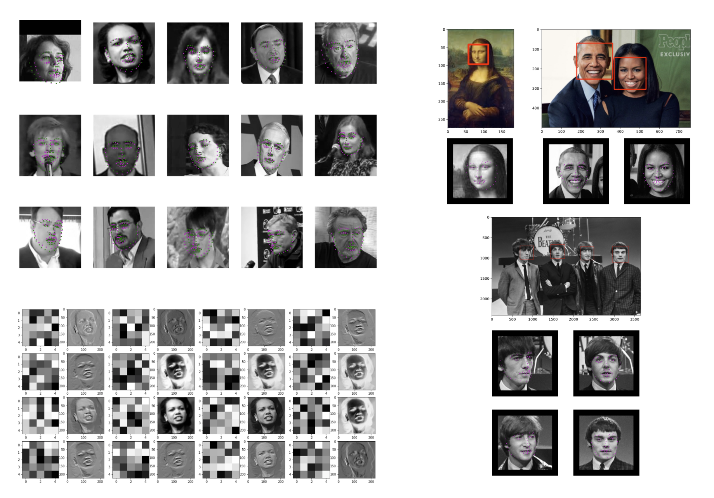
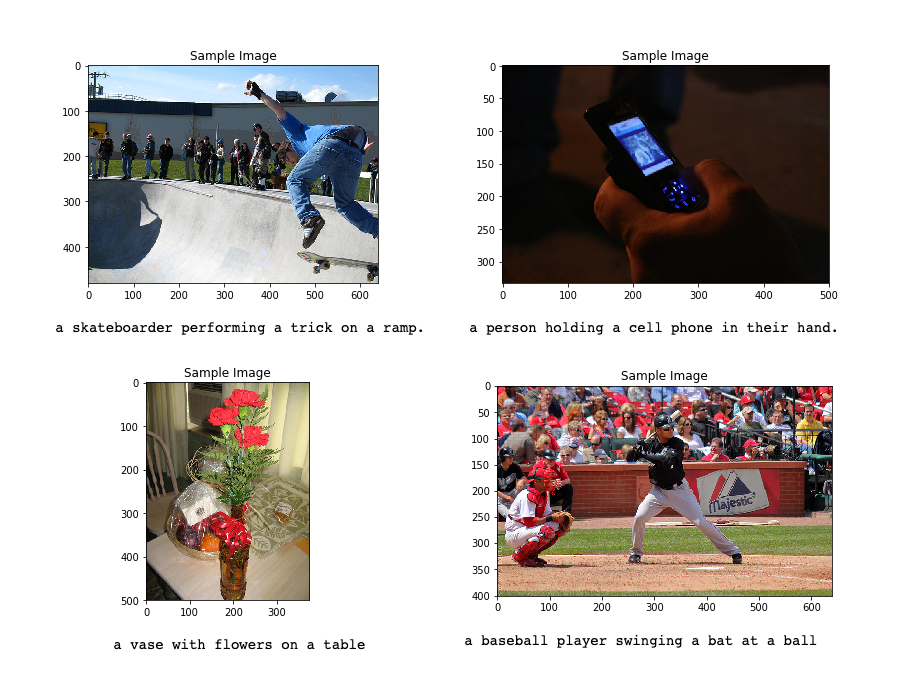

# Computer Vision Nanodegree
Projects developed for Udacity's Computer Vision Nanodegree Program

## Project 1: Facial Keypoint Detection

**Description:** Use image processing techniques and deep learning techniques to detect faces in an image and find facial keypoints, such as the position of the eyes, nose, and mouth on a face.

In this project, I performed image processing and feature extraction techniques that allowed me to programmatically represent different facial features. I used my knowledge of deep learning techniques to program a convolutional neural network (CNN) to recognize facial keypoints. Facial keypoints include points around the eyes, nose, and mouth on any face and are used in many applications, from facial tracking to emotion recognition.

The Udacity repository for this project: [P1_Facial_Keypoints](https://github.com/udacity/P1_Facial_Keypoints)

## Project 2: Automatic Image Captioning
**Description:** Combine CNN and RNN knowledge to build a deep learning model that produces captions given an input image.

In this project, I created a complex deep learning model with two components: a CNN that transforms an input image into a set of features, and an RNN that turns those features into rich, descriptive language. I implemented both of these cutting-edge deep learning architectures.

The Udacity repository for this project: [CVND---Image-Captioning-Project](https://github.com/udacity/CVND---Image-Captioning-Project)

## TODO: Project 3: Landmark Detection and Tracking (SLAM)
**Description:** Use feature detection and keypoint descriptors to build a map of the environment with Simultaneous Localization And Mapping (SLAM).

In this project, I implemented a robust method for tracking an object over time, using elements of probability, motion models, and linear algebra. This project tested my knowledge of localization techniques that are widely used in autonomous vehicle navigation.

The Udacity repository for this project: [P3_Implement_SLAM](https://github.com/udacity/P3_Implement_SLAM)
